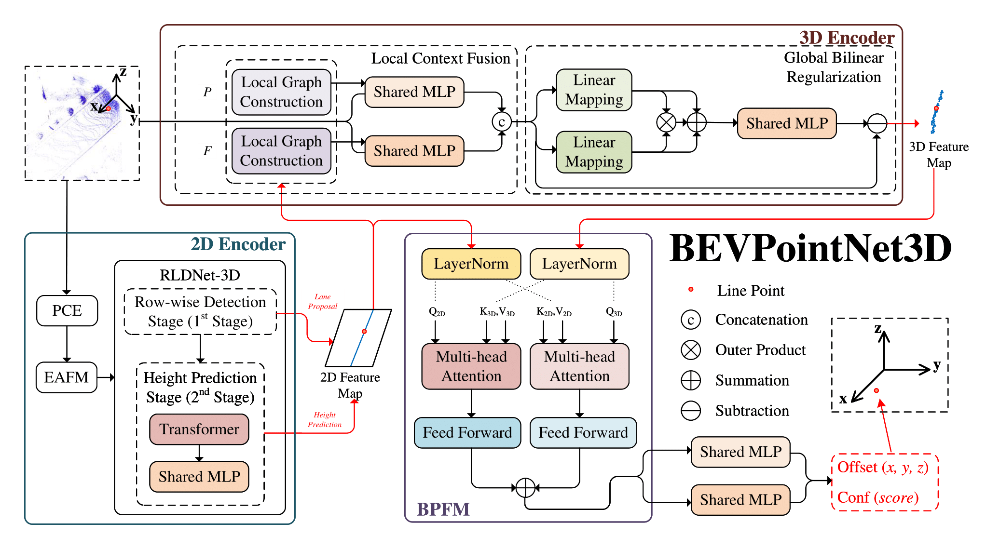
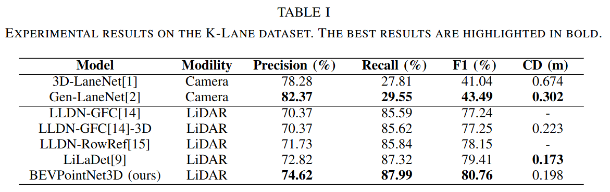
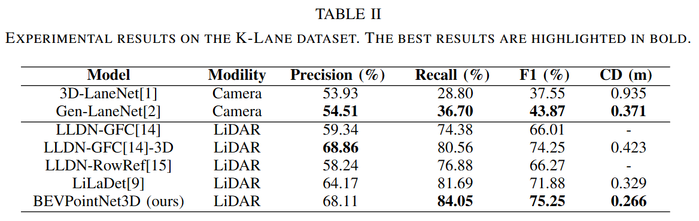
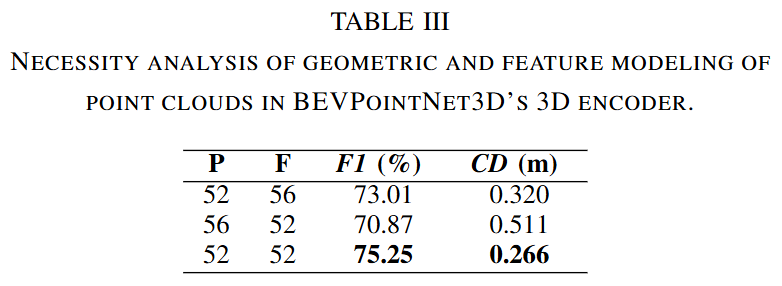
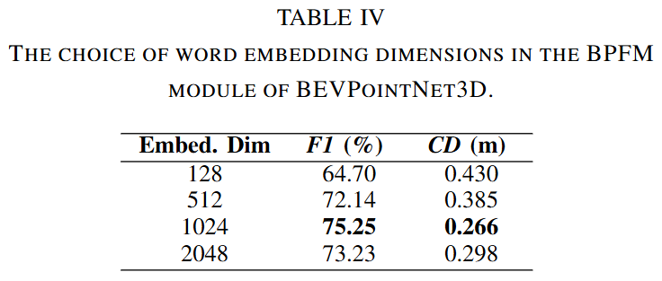

# BEVPointNet3D
Here's the framework of paper named "BEVPointNet3D: Fusing Bird's Eye View and Point Cloud Features for Robust 3D Lane Detection"

Below is the structure of the 2D encoder section omitted from the framework diagram
.png)

## Abstract
This paper introduces BEVPointNet3D, an innovative 3D lane detection model that effectively integrates Bird's Eye View (BEV) and point cloud features. The proposed approach addresses the inherent limitations of conventional methods that predominantly rely on the flat-ground assumption. BEVPointNet3D incorporates a 2D encoder adapted from EF2Lane to extract preliminary lane information from BEV images. For 3D feature extraction, the model employs a hierarchical local-to-global processing scheme to capture the geometric characteristics of LiDAR point clouds. A novel cross-attention mechanism is implemented to precisely align and integrate the 2D and 3D feature representations. This architectural design not only enhances detection accuracy but also significantly improves the model's robustness in complex driving scenarios. Comprehensive evaluations on the K-Lane and CampusLane datasets demonstrate the superior performance of BEVPointNet3D. Notably, the model exhibits exceptional capability in accurately estimating lane spatial positions on steep inclines, thereby providing reliable support for autonomous driving systems in challenging terrain conditions.

## Codes
Code coming soon!

## Experiment Results
The experimental results are presented below.

